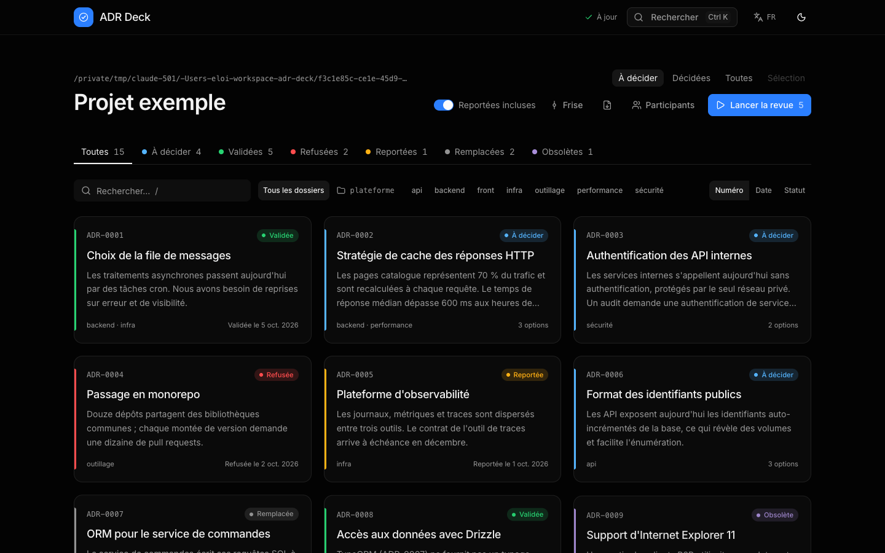
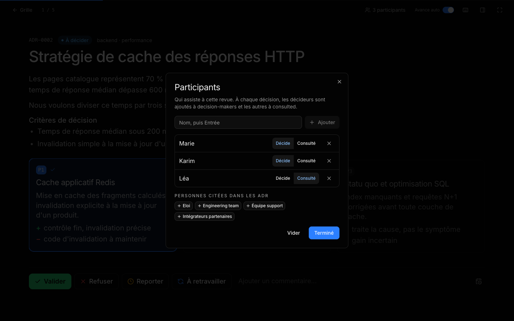
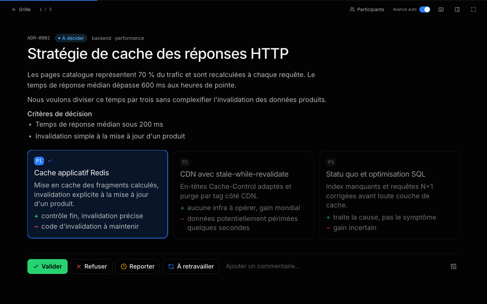
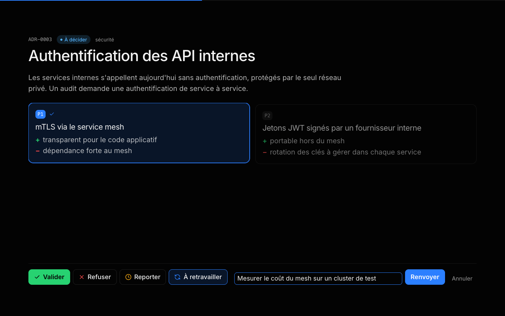
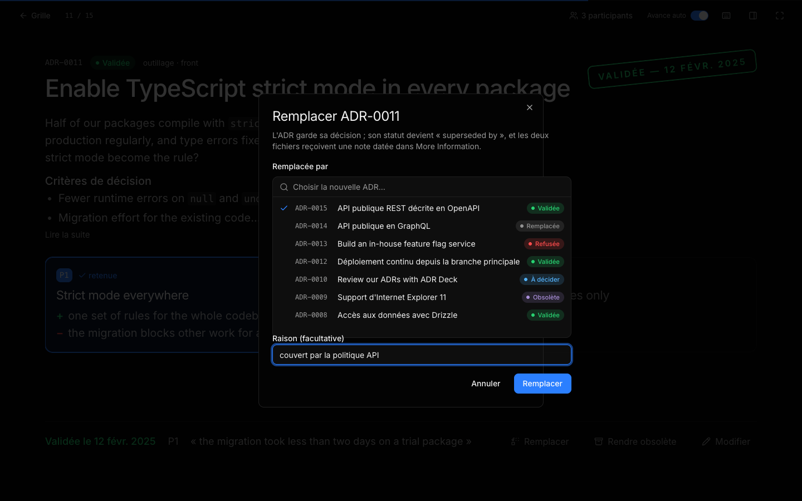
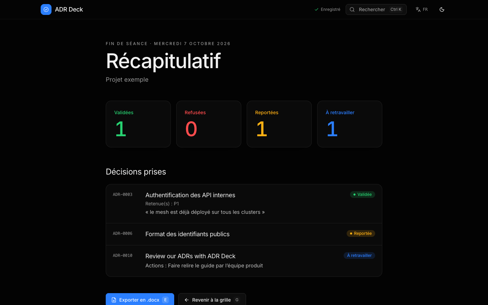
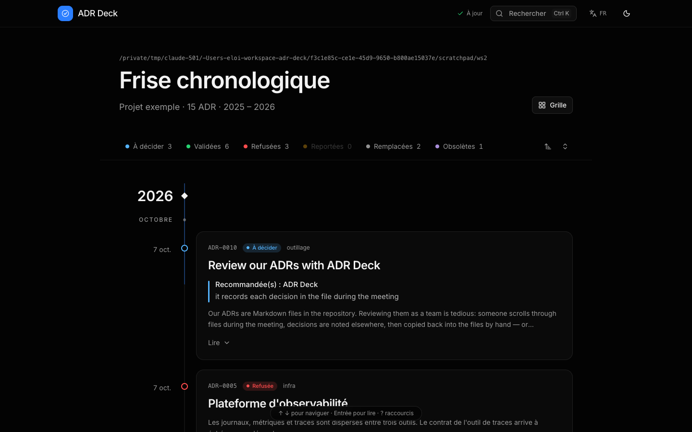
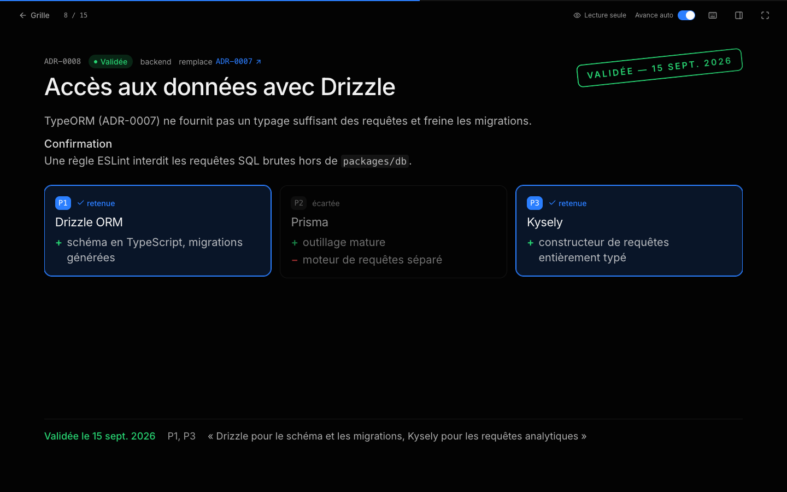

# Guide d'adr-deck

Ce guide explique **pourquoi** tenir des ADR, **en quoi** adr-deck répond aux difficultés connues de la pratique, puis **comment** s'en servir : commandes, options, écrans, format des fichiers et méthode de travail proposée.

Le [README](../README.md) (en anglais) reste la référence technique courte ; ce guide est la documentation d'usage complète.

## Sommaire

1. [Préambule : à quoi servent les ADR](#1-préambule--à-quoi-servent-les-adr)
2. [Ce que la pratique révèle, et ce qu'adr-deck y répond](#2-ce-que-la-pratique-révèle-et-ce-quadr-deck-y-répond)
3. [Installation et démarrage](#3-installation-et-démarrage)
4. [Commandes et options](#4-commandes-et-options)
5. [Les écrans](#5-les-écrans)
6. [Le format MADR tel qu'adr-deck le lit et l'écrit](#6-le-format-madr-tel-quadr-deck-le-lit-et-lécrit)
7. [Méthode proposée](#7-méthode-proposée)
8. [Questions fréquentes et limites](#8-questions-fréquentes-et-limites)

---

## 1. Préambule : à quoi servent les ADR

### Le problème

Une architecture logicielle est la somme de décisions : choix d'une base de données, découpage en services, protocole d'API, stratégie de cache, politique de déploiement… Chacune engage l'équipe pour des mois ou des années, et coûte cher à défaire.

Or ces décisions se perdent :

- **Elles vivent dans les têtes et dans les messageries.** Le « pourquoi » d'un choix est connu de ceux qui étaient dans la salle. Quand ils changent d'équipe, il disparaît (connaissance tacite).
- **Le code dit *comment*, jamais *pourquoi*.** Six mois plus tard, un nouvel arrivant voit un choix étrange, ignore la contrainte qui l'a motivé, et le défait ou le contourne.
- **Les mêmes débats reviennent.** Sans trace de ce qui a été envisagé et écarté, chaque question se rejoue, avec les mêmes arguments et la même perte de temps.
- **Les décisions implicites ne sont jamais revues.** Ce qui n'a pas été écrit ne peut pas être remis en question au bon moment.

### La réponse : l'Architecture Decision Record

Une ADR est un **document court qui consigne une seule décision** : son contexte, les options envisagées, celle retenue, et pourquoi ([Michael Nygard, 2011](https://cognitect.com/blog/2011/11/15/documenting-architecture-decisions) ; [Martin Fowler](https://martinfowler.com/bliki/ArchitectureDecisionRecord.html)). Les ADR sont rangées avec le code, numérotées, et forment ensemble le **journal des décisions** du projet.

Une ADR a un **cycle de vie** : proposée, puis acceptée ou rejetée ; plus tard, éventuellement remplacée par une nouvelle ADR ou rendue obsolète. Une ADR acceptée **ne se réécrit pas** : si la décision change, une nouvelle ADR la remplace, et l'historique reste lisible ([AWS Prescriptive Guidance](https://docs.aws.amazon.com/prescriptive-guidance/latest/architectural-decision-records/adr-process.html)).

### MADR

[MADR](https://adr.github.io/madr/) (*Markdown Architectural Decision Records*, version 4) est le format le plus répandu : un fichier Markdown par décision, `NNNN-titre.md`, rangé de préférence dans `docs/decisions/`. Il propose trois modèles :

| Modèle | Contenu |
| --- | --- |
| Complet | Métadonnées (`status`, `date`, `decision-makers`, `consulted`, `informed`), contexte, critères de décision, options, décision (avec `### Consequences` et `### Confirmation`), avantages et inconvénients de chaque option (`Good`, `Neutral`, `Bad`), informations complémentaires |
| Minimal | Contexte, options, décision et conséquences |
| Nu (*bare*) | Toutes les sections, sans texte d'aide |

Seuls le titre, le contexte, les options et la décision sont vraiment nécessaires ; le reste est facultatif.

---

## 2. Ce que la pratique révèle, et ce qu'adr-deck y répond

### Les constats

Les ADR sont unanimement recommandées et pourtant peu pratiquées :

- **Adoption faible et souvent abandonnée.** Environ la moitié des dépôts qui ont des ADR n'en comptent que 1 à 5 : on essaie, puis on arrête ([étude ICSA 2026](https://conf.researchr.org/details/icsa-2026/icsa-2026-papers/34/Architecture-Decision-Records-Adoption-Impact-and-Developer-Engagement-in-Open-Sou)). Les freins identifiés relèvent de la culture, de la connaissance tacite, du processus et des outils ([Chalmers](https://research.chalmers.se/en/publication/538920)).
- **Écrites, mais pas lues.** Les ADR s'accumulent sans que personne ne les consulte ; les nouvelles décisions se prennent sans s'y référer.
- **Pas de délibération.** Sur 5 800 ADR open source étudiées, 63 % sont créées directement en `accepted` : la discussion que l'ADR devait porter n'a pas eu lieu.
- **Les anti-modèles courants** ([10 ADR anti-patterns](https://jopr.org/blog/detail/10-adr-antipatterns)) : réécrire une ADR au lieu de la remplacer, ne garder que l'option choisie, ne vendre que les avantages, rédiger après coup, décider seul.

Le processus décrit par **AWS** fixe le cadre attendu ([AWS, ADR process](https://docs.aws.amazon.com/prescriptive-guidance/latest/architectural-decision-records/adr-process.html)) :

1. un propriétaire rédige l'ADR à l'état *Proposed* ;
2. la **réunion de revue** commence par 10 à 15 minutes de lecture, puis l'équipe discute ;
3. trois issues : **accepter** (avec date et parties prenantes), **rejeter** (en consignant la raison, pour ne pas rouvrir le débat), ou **garder en *Proposed* avec des actions** à mener avant une nouvelle revue ;
4. une ADR acceptée est **immuable** : un changement passe par une nouvelle ADR qui la **remplace** ;
5. les ADR servent ensuite de **référence en revue de code**.

### Les réponses d'adr-deck

| Constat ou étape | Réponse d'adr-deck |
| --- | --- |
| Les ADR ne sont pas lues | Une **revue en diaporama** : une ADR par diapositive, lisible à 3 m, menée au clavier par une seule personne qui partage son écran. La **frise chronologique** (`adr-deck timeline`) raconte l'histoire des décisions ; `adr-deck serve` la **partage en lecture seule** sur le réseau interne. |
| Pas de délibération, ADR acceptées d'emblée | Les ADR *proposed* sont le cœur de la séance : la décision se prend **en réunion**, devant l'équipe, et s'écrit dans le fichier à ce moment-là, avec la date du jour. |
| Décider seul (anti-modèle n°10) | **Participants** : en début de séance, on note qui est présent (décide ou consulté) ; chaque décision les ajoute à `decision-makers` et `consulted`. |
| Accepter, rejeter, ou **garder en *Proposed* avec des actions** (AWS) | Quatre issues sur chaque diapositive : **Valider**, **Refuser** (avec la raison), **Reporter** (avec une date de prochaine revue), **À retravailler** (l'ADR reste *proposed*, les actions sont écrites dans `### Actions`). |
| ADR immuable, changement = nouvelle ADR (AWS, anti-modèle n°5) | **Remplacer par…** et **Rendre obsolète** gardent la décision d'origine intacte et ajoutent une note datée ; le remplacement écrit aussi dans la nouvelle ADR (« Supersedes ADR-0007 »). |
| Ne garder que l'option choisie, cacher les inconvénients (n°6, n°7) | Chaque option a sa carte avec ses arguments `Good`, `Neutral`, `Bad` ; les **conséquences** de la décision sont affichées avant de décider. |
| Vérifier que la décision est appliquée (revue de code, AWS) | La section MADR **`### Confirmation`** est affichée ; une ADR acceptée sans confirmation est signalée sur sa diapositive et par `validate --strict`. |
| Reprendre un débat déjà tranché | `adr-deck add` **cherche les ADR proches** (titre, contexte) avant d'en créer une nouvelle. |
| Qualité et conformité des fichiers | `adr-deck validate` (erreurs bloquantes) et `validate --strict` (règles des modèles MADR et de markdownlint) en **CI**. |
| Les non-développeurs ne lisent pas Markdown | **Export `.docx`** (relecture, commentaires dans Word ou Google Docs) et **import** du document modifié vers les fichiers MADR. |
| Gros projets | **Dossiers de catégorie** (`docs/decisions/backend/…`), filtre par catégorie, numérotation unique vérifiée. |
| Rédiger après coup, perdre la source | Le skill Claude Code **`adr-extract`** transforme un compte rendu, un PDF ou un fil de discussion en ADR MADR, sans rien inventer. |

Ce qu'adr-deck **ne fait pas** (encore) : minuter le temps de lecture en début de séance, planifier la revue périodique des ADR acceptées (seules les ADR reportées ont une date de prochaine revue), relier automatiquement une ADR au code qui l'applique.

---

## 3. Installation et démarrage

Prérequis : **Node.js ≥ 22.22**.

```sh
git clone <dépôt> adr-deck && cd adr-deck
nvm use              # Node 22.22, lu dans .nvmrc
npm install
npm run install:global
```

La commande `adr-deck` est alors disponible partout. C'est une copie autonome (installée depuis le tarball) : elle ne dépend plus du dépôt. Pour mettre à jour : `npm run install:global` ; pour désinstaller : `npm run uninstall:global`. Avec nvm, la commande n'existe que pour la version de Node active lors de l'installation.

Première revue :

```sh
cd ~/workspace/mon-projet
adr-deck
```

Le navigateur s'ouvre sur la grille des ADR du projet.

---

## 4. Commandes et options

### Commandes

| Commande | Rôle |
| --- | --- |
| `adr-deck [review] [dossier]` | Revue des ADR du dossier (défaut : dossier courant) |
| `adr-deck timeline [dossier]` | Même application, ouverte sur la frise chronologique |
| `adr-deck serve [dossier]` | Partage la frise **en lecture seule** sur le réseau local (écoute sur `0.0.0.0`, n'ouvre pas le navigateur) |
| `adr-deck add [dossier]` | Crée une ADR en répondant à des questions |
| `adr-deck export [sortie.docx]` | `.docx` de toutes les ADR |
| `adr-deck import <fichier.docx> [dossier]` | `.docx` exporté (éventuellement modifié) → fichiers MADR |
| `adr-deck validate [chemin…]` | Contrôle des fichiers ou dossiers ; code de sortie 1 en cas d'erreur |
| `adr-deck --help` / `--version` | Aide / version |

### Options

| Option | Commandes | Rôle | Variable |
| --- | --- | --- | --- |
| `-p, --port <port>` | review, timeline, serve | Port (défaut 8787, ou le suivant libre) | `ADR_PORT` |
| `--host <hôte>` | review, timeline, serve | Adresse d'écoute (défaut `127.0.0.1`, `0.0.0.0` pour serve) | `ADR_HOST` |
| `--no-open` / `--open` | review, timeline / serve | Ne pas ouvrir / ouvrir le navigateur | — |
| `--read-only` | review, timeline | Refuse toute modification des fichiers (toujours actif pour serve) | — |
| `-d, --dir <dossier>` | toutes | Dossier de départ | — |
| `-o, --output <fichier>` | export | Fichier `.docx` produit | — |
| `-l, --lang <en\|fr\|es>` | export | Langue des libellés du `.docx` (défaut en) | — |
| `-f, --force` | import | Écrase aussi les ADR dont le contenu a changé | — |
| `--strict` | validate | Ajoute les règles des modèles MADR et de markdownlint ; les avertissements font aussi échouer | — |
| `--minimal` | add | Seulement les questions du modèle MADR minimal | — |
| `-c, --category <dossier>` | add | Dossier de catégorie de la nouvelle ADR (`backend`) | — |

Toute la sortie terminal est en anglais. `Ctrl+C` arrête le serveur immédiatement ; un second `Ctrl+C` force la sortie.

### Où les ADR sont cherchées

Les ADR sont les fichiers `NNNN-titre.md` (au moins 3 chiffres). Le premier dossier qui en contient est retenu :

1. le dossier de lancement (ses fichiers directs) ;
2. `docs/decisions` (convention MADR), `docs/adr`, `doc/adr`, `docs/architecture/decisions`, `adr`, `decisions`, sous-dossiers de catégorie compris.

Dans le dossier retenu, les **sous-dossiers de catégorie** sont lus sur deux niveaux (`backend/0012-x.md`, `ui/forms/0013-y.md`) ; les dossiers cachés et `node_modules`, `dist`, `build`, `target`, `vendor` sont ignorés. Les autres `.md` (`README.md`, `template.md`) sont ignorés.

### `adr-deck add`

Les questions s'enchaînent dans le terminal :

1. titre et contexte ; **adr-deck cherche alors les ADR proches** (mots du titre et du contexte, pondérés par leur rareté dans le dossier) et, s'il en trouve, les liste avec leur statut avant de demander « Create a new ADR anyway? » ;
2. catégorie, si le dossier a des sous-dossiers (ou `--category`) ;
3. critères de décision (sauf `--minimal`) ;
4. options, avec description et arguments Good, Neutral, Bad (sauf `--minimal`) ;
5. statut (`proposed` par défaut), options retenues ou recommandées, date de prochaine revue pour `deferred`, justification ;
6. si une option est retenue ou recommandée : conséquences (Good, Bad) et, sauf `--minimal`, **Confirmation** ;
7. décideurs, consultés, informés, tags, informations complémentaires, ADR remplacée (sauf `--minimal`).

Le fichier reçoit le numéro suivant (sur tout le dossier, catégories comprises), la date du jour (Europe/Paris) et la langue de titres de la majorité des ADR du dossier. Rien n'est écrit avant la confirmation finale.

### `adr-deck validate`

| Niveau | Contrôles |
| --- | --- |
| Erreurs (toujours) | Titre `#` absent, front matter YAML invalide, numéro en double (sous-dossiers compris) |
| Avertissements (toujours) | Statut inconnu, aucune option, option retenue absente des options, ADR de remplacement introuvable |
| `--strict` | Contexte absent ; ADR décidée sans phrase de décision ; ADR acceptée sans `### Confirmation` ; règles markdownlint de la configuration MADR (MD001, MD004, MD009, MD010, MD012, MD018, MD019, MD022, MD023, MD025, MD031, MD032, MD034, MD040, MD041, MD047 — MD013 et MD024 désactivées comme dans MADR) |

Le mode strict n'exige **pas** les sections facultatives (critères, avantages et inconvénients, informations complémentaires, métadonnées) : un fichier au modèle minimal le passe. Les 15 exemples du dépôt le passent aussi (`npm run validate:example`).

### `adr-deck serve`

```sh
adr-deck serve docs/decisions
# adr-deck — http://localhost:8787/timeline  http://192.168.1.20:8787/timeline  (read-only)
```

Le serveur écoute sur toutes les interfaces et affiche les adresses du réseau local. Toute écriture est refusée (`403`). L'interface masque les boutons de décision, l'édition, les participants, et affiche « Lecture seule ». La revue en diaporama reste disponible pour **présenter** les décisions. Pour se limiter à la machine : `--host 127.0.0.1`.

Il n'y a pas d'authentification : à réserver à un réseau de confiance.

---

## 5. Les écrans

### La grille



Toutes les ADR du dossier : onglets de statut avec compteurs, recherche plein texte (`/`), filtre par **catégorie** (dossier) et par tag, tri par numéro, date ou statut. Un clic sur une carte ouvre le diaporama sur cette ADR ; le point en coin de carte l'ajoute à une sélection. Les fichiers illisibles sont listés dans un encart repliable (fichier, ligne, message).

En haut : contenu du diaporama (À décider, Décidées, Toutes, Sélection), reportées incluses ou non, frise (`T`), export `.docx`, **Participants**, et **Lancer la revue** (`R`).

### Les participants



Facultatif, en début de séance (bouton **Participants** de la grille ou du diaporama, ou palette `Ctrl+K`). On ajoute chaque présent, en tapant son nom ou en reprenant une personne déjà citée dans les ADR, et on indique s'il **décide** ou s'il est **consulté**.

À chaque décision (valider, refuser, reporter, retravailler, remplacer, rendre obsolète), les décideurs sont ajoutés à `decision-makers`, les autres à `consulted`. Les noms déjà présents sont gardés, sans doublon, et le style de liste du fichier (`a, b`, `[a, b]` ou liste à tirets) est conservé. Sans participant, ces métadonnées ne sont pas touchées. La liste vaut pour l'onglet du navigateur (elle survit à un rechargement, pas à une nouvelle séance).

### La diapositive



Pour chaque ADR : numéro, statut, catégorie, tags, titre ; le contexte, les critères de décision, les **actions en cours** (après un retravail), les **conséquences** et la **confirmation** (« Lire la suite » quand le texte dépasse) ; puis une carte par option avec ses arguments `+` (Good), `○` (Neutral) et `−` (Bad).

En bas, la barre de décision :

| Bouton | Touche | Effet |
| --- | --- | --- |
| **Valider** | `V` | Exige au moins une option (`1` à `9`, plusieurs possibles) |
| **Refuser** | `X` | Aucune option ; le commentaire devient la raison |
| **Reporter** | `P` | Date de prochaine revue facultative (icône calendrier) |
| **À retravailler** | `W` | Ouvre la saisie des actions, une par ligne ; `Entrée` renvoie, `Maj+Entrée` passe à la ligne |
| Commentaire | `C` | Justification écrite dans la phrase de décision |

Une ADR *proposed* dont la décision nomme déjà une option (`Chosen option: "…"`) arrive avec cette option présélectionnée et sa justification. Après une décision, un tampon s'affiche et la diapositive suivante arrive après 1,2 s (avance automatique désactivable). `Ctrl+Z` annule la dernière décision de la séance : les fichiers retrouvent **exactement** leur contenu précédent.

### Retravailler



L'issue « garder en *Proposed* avec des actions » du processus AWS. L'ADR reste `proposed`, sa date est mise à jour, et les actions sont ajoutées, cases à cocher, dans `## More Information` → `### Actions`. Elles s'affichent ensuite sur sa diapositive tant qu'elles ne sont pas cochées (`* [x]`) dans le fichier. Sa recommandation éventuelle est gardée.

### Une décision prise : remplacer ou rendre obsolète


Une ADR décidée s'affiche en lecture : tampon, options retenues et écartées, justification. Une ADR acceptée sans `### Confirmation` porte la mention « sans confirmation ». Trois actions :

- **Modifier** (`M`) rouvre la décision ;
- **Remplacer** (ADR acceptée ou obsolète) ;
- **Rendre obsolète** (ADR acceptée).



« Remplacer » demande l'ADR qui la remplace (recherche par numéro ou titre) et une raison facultative. Les deux fichiers sont modifiés en **une seule étape annulable** :

- l'ancienne : `status: superseded by ADR-0015` et, dans More Information, « Superseded by ADR-0015 on 2026-10-07, because … » ; **sa phrase de décision et sa date ne changent pas** ;
- la nouvelle : « Supersedes ADR-0011 (titre). » dans More Information.

« Rendre obsolète » fait de même avec `status: deprecated` et « Deprecated on … ».

Une ADR remplacée affiche un lien vers sa remplaçante (touche `L`), et la remplaçante un lien en retour.

### Le récapitulatif



En fin de diaporama : compteurs de la séance (validées, refusées, reportées, à retravailler), liste des décisions avec options retenues, commentaires et actions, export `.docx` (`E`). Le récapitulatif couvre la séance en cours ; les décisions elles-mêmes sont dans les fichiers.

### La frise chronologique



`adr-deck timeline`, `T` depuis la grille, ou `Ctrl+K`. Les ADR sont placées à leur date de décision, regroupées par année et par mois ; les non datées viennent à la fin. **Lire** (`Entrée`) déplie l'ADR entière ; `A` déplie tout. Filtres de statut, ordre chronologique ou inverse. `/timeline?at=ADR-0007` ouvre directement sur une ADR.

### Lecture seule



Avec `adr-deck serve` ou `--read-only` : aucun bouton de décision, d'édition ni de participants ; la mention « Lecture seule » remplace l'indicateur d'enregistrement.

### Raccourcis

`?` affiche l'aide dans le diaporama et la frise.

| Touche | Action |
| --- | --- |
| `←` / `→` | ADR précédente / suivante |
| `1` à `9` | Sélectionner une option |
| `V` / `X` / `P` / `W` | Valider / Refuser / Reporter / À retravailler |
| `C` | Commentaire |
| `M` | Modifier une décision |
| `L` | Aller à l'ADR remplaçante |
| `S` | Sommaire du diaporama |
| `G` | Retour à la grille |
| `F` | Plein écran |
| `Ctrl+Z` / `⌘Z` | Annuler la dernière décision |
| `Ctrl+K` / `⌘K` | Recherche et actions |
| `R` / `/` / `T` (grille) | Lancer la revue / rechercher / frise |
| `↑` `↓` ou `J` `K`, `Entrée`, `A` (frise) | Naviguer, lire, tout déplier |
| `E` (récapitulatif) | Export `.docx` |

### Langues et thème

L'interface est en **anglais, français et espagnol** : elle suit la langue du navigateur ; le bouton de langue de l'en-tête fixe un choix (mémorisé). Thème sombre par défaut, clair ou système.

---

## 6. Le format MADR tel qu'adr-deck le lit et l'écrit

### Lecture

| Élément | Usage |
| --- | --- |
| Front matter | `status`, `date`, `decision-makers` (ou `deciders` de MADR 3), `consulted`, `informed`, plus les extensions `tags` et `next-review`. Toute autre clé est gardée telle quelle. Sans front matter : ADR `proposed`. |
| `# Titre` | Titre de la diapositive (obligatoire) |
| `## Context and Problem Statement` | Contexte |
| `## Decision Drivers` | Critères de décision |
| `## Considered Options` | Une option par puce → cartes P1, P2… |
| `## Decision Outcome` | Phrase de tête `Chosen option: "A", because …` → options retenues et justification ; `### Consequences` et `### Confirmation` affichées à part |
| `## Pros and Cons of the Options` | Sous-sections `### <option>` : description, `Good, because`, `Neutral, because`, `Bad, because` |
| `## More Information` | Gardée ; `### Actions` y porte les actions de retravail |

Les titres français courants sont reconnus (`Contexte et problématique`, `Options envisagées`, `Décision`, `Bon, car`, `Neutre, car`, `Mauvais, car`…).

### Statuts

| `status` MADR | Dans l'application | Écrit par |
| --- | --- | --- |
| `proposed` (ou absent, `draft`) | À décider | — ou **À retravailler** |
| `accepted` | Validée | Valider |
| `rejected` | Refusée | Refuser |
| `deferred` (+ `next-review`) | Reportée | Reporter |
| `superseded by ADR-0012` | Remplacée | Remplacer par… |
| `deprecated` | Obsolète | Rendre obsolète |

`deferred`, `next-review` et `tags` sont des extensions permises par MADR (métadonnées facultatives, liste de statuts ouverte).

### Écriture : ce qui change dans le fichier

adr-deck fait des **modifications ciblées** ; le reste du fichier est conservé à l'octet près (fins de ligne CRLF comprises), et chaque opération s'annule exactement.

| Opération | Front matter | Decision Outcome | More Information |
| --- | --- | --- | --- |
| Valider, Refuser, Reporter | `status`, `date` du jour, `next-review` (reporter), participants | Phrase de tête réécrite ; sous-sections gardées | — |
| À retravailler | `status: proposed`, `date` du jour, participants | Inchangée | Actions ajoutées sous `### Actions` |
| Remplacer par… | `status: superseded by ADR-x`, participants ; **date inchangée** | Inchangée | Note datée ; note « Supersedes » dans la nouvelle ADR |
| Rendre obsolète | `status: deprecated`, participants ; **date inchangée** | Inchangée | Note datée |

La phrase écrite suit la langue des titres du fichier (`Chosen option: "A", because …` ou `Option retenue : « A », car …`). Une section manquante est créée à sa place MADR.

### Sûreté des écritures

- **Révision par fichier** : chaque écriture porte l'empreinte du contenu connu (`If-Match`) ; si le fichier a changé ailleurs, l'application le relit et **rejoue** les décisions en attente.
- **Écriture atomique** (fichier temporaire puis renommage) et **refus d'un contenu invalide**.
- **Sauvegarde** de la version précédente (10 dernières par fichier) dans `~/.adr-deck/backups/`, hors du dépôt.
- **Rechargement à chaud** : un fichier modifié dans un éditeur ou par `git pull` est relu sans perdre les décisions en cours ; un fichier ajouté ou supprimé apparaît ou disparaît.

---

## 7. Méthode proposée

### Cycle de vie d'une ADR

```text
            ┌──────────── À retravailler (actions) ───────────┐
            ▼                                                 │
 rédaction → proposed ──── revue ───┬── accepted ──┬── superseded by ADR-x
                ▲                   ├── rejected   └── deprecated
                └──── deferred ◄────┘   (raison consignée)
                    (next-review)
```

1. **Rédiger** une ADR `proposed` dès que la question se pose : `adr-deck add` (ou `--minimal`), à la main depuis `templates/madr.md`, ou avec le skill `adr-extract` depuis un compte rendu. Le propriétaire de l'ADR peut nommer sa recommandation (`Chosen option: …`) : elle sera présélectionnée.
2. **Faire relire** avant la séance : pull request sur le fichier, ou export `.docx` pour les relecteurs non techniques.
3. **Revoir en séance** (ci-dessous).
4. **Appliquer** la décision ; la **Confirmation** dit comment le vérifier (revue de code, test d'architecture, règle de lint).
5. **Ne jamais réécrire** une ADR décidée : la **remplacer** ou la **rendre obsolète**.

### Déroulé d'une séance de revue

| Temps | Action dans adr-deck |
| --- | --- |
| Avant | `git pull` ; `adr-deck validate --strict` ; ouvrir `adr-deck` et vérifier le nombre d'ADR à décider |
| Ouverture | **Participants** : noter qui décide et qui est consulté |
| Pour chaque ADR | Lecture silencieuse du contexte, des options et des conséquences (« Lire la suite ») ; discussion ; puis **Valider**, **Refuser** (avec la raison), **Reporter** (avec une date) ou **À retravailler** (avec les actions) |
| ADR anciennes | Mode « Décidées » : **Remplacer** ou **Rendre obsolète** ce qui ne tient plus |
| Clôture | **Récapitulatif**, export `.docx` à diffuser aux informés |
| Après | `git diff docs/decisions` puis commit (« ADR review 2026-10-07 ») et pull request : git garde l'historique |

Une séance n'a besoin que d'une personne aux commandes, écran partagé, tout au clavier.

### Où ranger les ADR

| Organisation | Quand | Comment |
| --- | --- | --- |
| **Dans le dépôt du projet** (recommandé) | Les décisions concernent ce code | `docs/decisions/` à la racine ; les ADR évoluent avec le code, se relisent en pull request, et servent en revue de code. Lancer `adr-deck` depuis la racine du projet. |
| **Catégories** | Gros projet, plusieurs domaines | `docs/decisions/backend/`, `docs/decisions/front/`… (deux niveaux au plus). Numérotation **unique** sur tout le dossier (un doublon est une erreur). `adr-deck add --category backend`. |
| **Dépôt dédié aux décisions** | Décisions transverses à plusieurs projets, ou d'organisation | Un dépôt `architecture-decisions` avec son `docs/decisions/` ; `adr-deck review ~/workspace/architecture-decisions`. |
| **Dossier partagé** (Google Drive, volume réseau) | Équipe sans git | Les modifications externes sont détectées (scrutation toutes les 3 s) ; les sauvegardes restent sur le poste dans `~/.adr-deck`. |

### Diffuser et faire relire hors de l'équipe technique

- **Lecture continue** : `adr-deck serve` sur une machine de l'équipe expose la frise en lecture seule sur le réseau interne.
- **Document** : `adr-deck export decisions.docx --lang fr` produit une page de garde, un tableau de synthèse et une section par ADR (tout le contenu MADR : métadonnées, options, arguments, décision, conséquences, confirmation, catégories).
- **Retour** : le `.docx` modifié dans Word ou Google Docs (textes, statuts, options) revient en fichiers MADR avec `adr-deck import decisions.docx`. Une ADR inchangée n'est pas touchée ; une ADR modifiée n'est écrasée qu'avec `--force`. `importDocx(exportDocx(adrs))` redonne les mêmes ADR.

### Intégration continue

```yaml
# .github/workflows/adr.yml (extrait)
- run: npx adr-deck validate --strict docs/decisions
```

`validate` échoue sur une erreur ; `--strict` aussi sur un avertissement (contexte absent, ADR acceptée sans confirmation, règle markdownlint).

---

## 8. Questions fréquentes et limites

| Question | Réponse |
| --- | --- |
| Je recharge la page : le récapitulatif est vide | Il couvre la séance du navigateur ; les décisions sont bien dans les fichiers. `Ctrl+Z` ne vaut aussi que pour la séance. |
| Où est l'historique d'une ADR ? | Dans git (MADR ne garde pas d'historique dans le fichier) et dans les notes datées de More Information. |
| Une ADR n'apparaît pas | Elle a une erreur : encart en haut de la grille ou `adr-deck validate`. |
| Deux équipes décident en même temps | Pas de mode multi-utilisateur en temps réel : une personne mène la revue ; les conflits de fichiers sont détectés et rejoués. |
| `adr-deck: command not found` | Version de Node différente de celle de l'installation (nvm) : `nvm use 22.22` ou `npm run install:global`. |
| Le port 8787 est pris | Le suivant libre est utilisé ; avec `--port` explicite, en choisir un autre. |

Limites connues : pas de minuteur de lecture, pas de revue périodique des ADR acceptées, pas de lien automatique entre une ADR et le code, pas d'authentification pour `serve`, sous-dossiers limités à deux niveaux.
